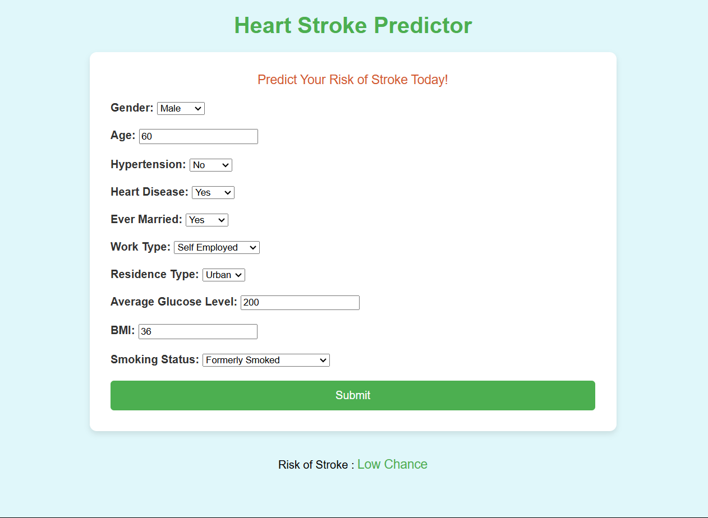

# Stroke-Prediction 
[](https://colab.research.google.com/drive/1B2ageylGg7KOqaDlx0I7oB_mwf_FWBQ-?usp=drive_link)
## Overview
- Stroke is the 2nd leading cause of death globally, responsible for approximately 11% of total deaths. The given dataset can be used to predict whether a patient is likely to get a stroke based on the input parameters like gender, age, bmi value, various diseases, and smoking status.
## Built using:
- [Scikit Learn: ](https://scikit-learn.org/stable/) ML Library used
- [React Js: ](https://developer.mozilla.org/en-US/docs/Learn/Tools_and_testing/Client-side_JavaScript_frameworks/React_getting_started) React Js documentation used
- [Flask: ](https://flask.palletsprojects.com/en/3.0.x/tutorial/) Flask framework used
- [Pandas: ](https://pandas.pydata.org/) Python data manipulation libraries
- [Seaborn: ](https://seaborn.pydata.org/) Data visualisation library
## Pipeline:
### 1. Stroke Final.ipynb
This is the main file with all the preprocessing, visualisations, various Machine learning and Deep Learning Models.
- Installing libraries and dependency
- Importing the dataset - [Stroke Prediction Dataset](https://www.kaggle.com/datasets/fedesoriano/stroke-prediction-dataset) 
- Exploratory Data Analysis and Visualisation
- Data Preprocessing - Basic preprocessing and cleaning the dataset
- Dividing the dataset into train and test
- Applying Machine Learning models
- Following Models were Implemented:
1. Decision Tree Classifier
2. Random Forest Classifier
3. XGB Classifier
4. LGBM Classifier
5. Logistic Regression
6. SVC
7. Decision Tree Classifier(With HyperParameter Tuning)
8. Random Forest Classifier(With HyperParameter Tuning)
9. XGB Classifier(With HyperParameter Tuning)
10. LGBM Classifier(With HyperParameter Tuning)
11. Logistic Regression(With HyperParameter Tuning)
12. SVC(With HyperParameter Tuning)
- Saving the weights and .pkl file for deployment
## How to run model:
- Run the cells according to above mentioned pipeline
- Model with highest accuracy (Random forest classifier) will be saved in .pkl extension.

## How to run project:
- Install Node.js and Python on system
- Clone the repository
```bash
git clone https://github.com/Khemchand992/Stroke-Predictio.git
cd Stroke-Predictio
```
- Install the required Python packages:
```bash
cd Backend
pip install -r requirements.txt
```
- Nevigate to root directory of project and install required npm packages
```bash
cd ..
npm i
```
- Nevigate to Client folder and install required npm packages as above
```bash
cd Client
npm i
```
- Run the project with following command
```bash
npm run dev
```

